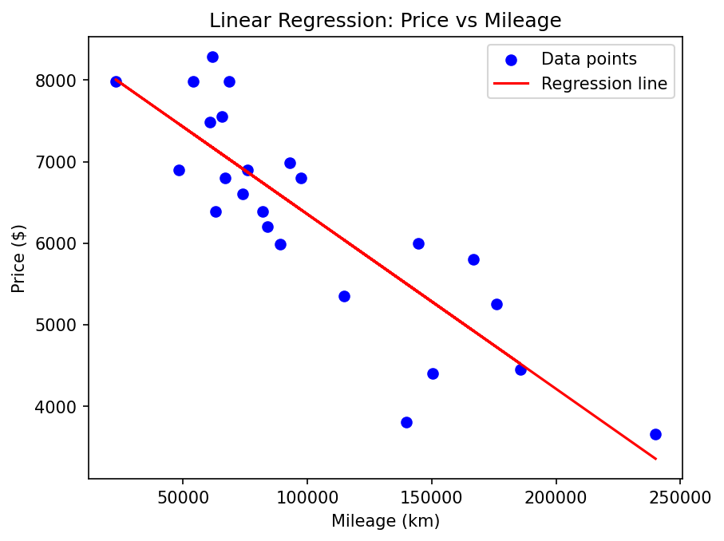
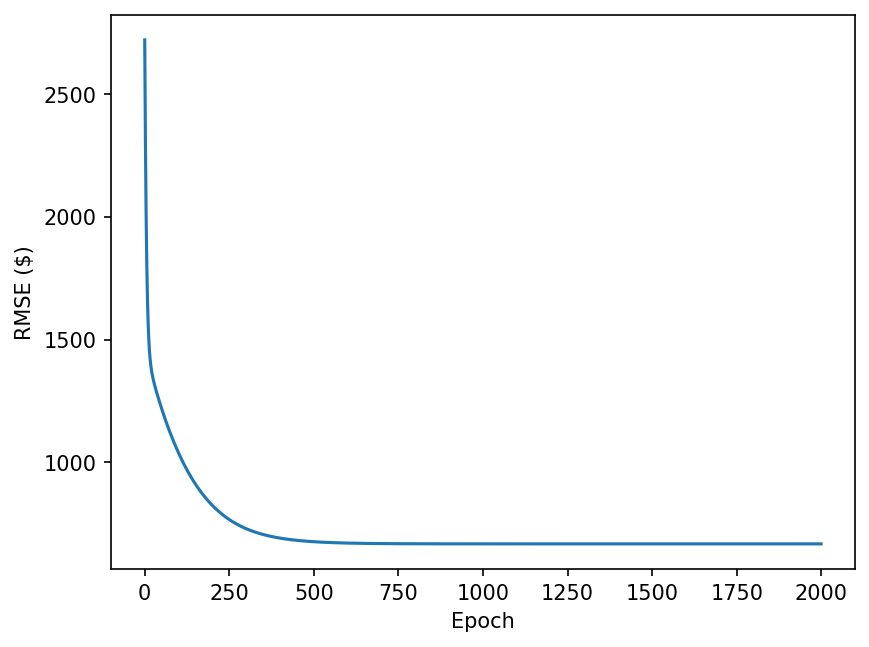

# ft_linear_regression

L’objectif est d’implémenter une **régression linéaire simple** entièrement en Python, sans utiliser de bibliothèques de machine learning.  
*Réalisé par [Naïm Ferrad](https://github.com/Nyn9)*

## 🎯 Objectifs du projet
- Implémenter **une descente de gradient** manuelle.
- Calculer les **prédictions** d’un modèle linéaire :
[ y = θ₀ + θ₁ * x ]
- Normaliser les données pour stabiliser l’entraînement.
- Suivre l’évolution :
  - de la **droite de régression**,
  - du **RMSE** au fil des epochs.
- Sauvegarder les paramètres entraînés dans `theta.json`.

---

## ⚙️ Installation & Lancement

### 1. Cloner le projet
```bash
git clone https://github.com/Nyn9/ft_linear_regression
cd ft_linear_regression
```

2. Créer un environnement virtuel (recommandé)

```bash
python3 -m venv .venv
source venv/bin/activate   # Linux / macOS
venv\Scripts\activate      # Windows
```

3. Installer les dépendances

```bash
pip install -r requirements.txt
```

4. Lancer l’entraînement

```bash
python3 ft_linear_regression.py
```

⚠️ Important

Le script predict.py dépend de l’entraînement réalisé par ft_linear_regression.py.
Il lit les valeurs entraînées dans data/theta.json.


## ⚙️ Arguments disponibles (ft_linear_regression.py)

### `-v`, `--verbose`
Affiche les informations détaillées à chaque epoch :
- θ₀ réel  
- θ₁ réel  
- RMSE  
- Ligne de séparation  

---

### `-g`, `--graph {d, r, rd, dr}`
Affiche les graphiques demandés après l'entraînement.

Options :
- `d` → données + droite de régression  
- `r` → courbe du RMSE  
- `rd` / `dr` → les deux graphiques  

---

### `-s`, `--save`
Sauvegarde les graphiques dans `graph/` :
- `graph/regression.png`
- `graph/rmse.png`

Le dossier est créé automatiquement si besoin.

---

### `-l`, `--limit`
Stoppe la descente de gradient lorsque la diminution du coût entre deux epochs devient **< 1e-9**.  
Permet d’éviter des itérations inutiles.

---

### `-e`, `--epochs <int>`
Nombre d’epochs à exécuter.

- Valeur par défaut : **2000**
- Doit être un entier strictement positif

---

## 📊 Graphiques

### Droite de régression obtenue


### Courbe du RMSE


